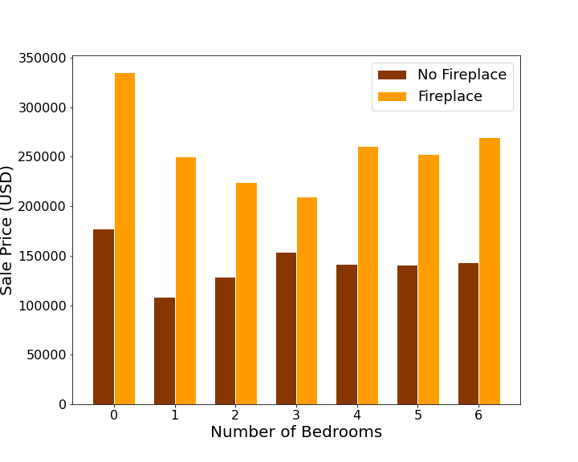

# Ames Housing and Kaggle Data Challenge

## Problem Statement

Is it a good financial investment to install a fireplace in Ames, Iowa?

## Data Dictionary
The data used in this model is described in the following data dictionary:

|Feature|Type|Dataset|Description|
|---|---|---|---|
|Id|int|AmesHousing.txt|House Id number| 
|MS SubClass|object|AmesHousing.txt|Class of structure ex: 1-STORY 1945 & OLDER|
|Overall Qual|int|AmesHousing.txt|Overall quality of the material and finish of the house|
|Year Built|int|AmesHousing.txt|Year buit|
|Year Remod/Add|int|AmesHousing.txt|Year remodeled or year built if not remodeled|
|Exter Qual|int|AmesHousing.txt|Quality of the material on the exterior|
|Bsmt Qual|int|AmesHousing.txt|Height of the basement ceiling|
|Total Bsmt SF|float|AmesHousing.txt|Total square footage of the basement|
|1st Flr SF|int|AmesHousing.txt|First floor square feet|
|2nd Flr SF|int|AmesHousing.txt|Second floor square feet|
|Gr Liv Area|int|AmesHousing.txt|Square feet of living area above ground|
|All Bath|int|AmesHousing.txt|Sum of above ground bathrooms and basement full baths|
|Kitchen Qual|int|AmesHousing.txt|Kitchen quality|
|TotRms AbvGrd|int|AmesHousing.txt|Total number of rooms above ground|
|Fireplaces|int|AmesHousing.txt|Number of fireplaces in the house|
|Garage Cars|float|AmesHousing.txt|Car capacity of the garage|
|Garage Area|float|AmesHousing.txt|Size of garage in square feet|
|SalePrice|int|AmesHousing.txt|The price for which the house sold|

## Analysis

To answer my problem statement I begain by identifying the features of the data that most strongly correlated with the sale price of the house. The features included number of fireplaces among many others but from a plot of some of the data it is clear that fireplaces are a significant factor.
### Bedrooms vs Price

The figure shows that across all bedroom counts, the existance of a fireplace in the house is correlated to a higher sale price. Sale prices are averaged over all houses fitting the catagory description.

I created a model to predict house sale price. The model included a parameter for how much the price would change based on the addition of a fireplace. The parameter indicates that for every fireplace a structure has, the sale price would increase by \$10296. The estimated cost of fireplaces as stated by homeguide.com is under \$6000 for all styles of fireplace.

The model was also submitted to a competition to predict housing prices. The model was compared to other models for accuracy in predictions. This model was 7th of 22 competitors at time of writing. Final results are expected to be revealed 11/16/2020.

## Conclusion and Recommendation

It is a great investment to add a fireplace to your home. Even a very expensive masonry fireplace was estimated to be under the \$10000 increase of the property value. This doesn't factor in the possible fuel savings that might also result from the fireplace. 

These results are only relavent for Ames Iowa. Any other location would have differing results and it is very likely that a warmer climate would drasticly alter this conclusion.

## Sources

https://www.usclimatedata.com/climate/ames/iowa/united-states/usia0026

https://homeguide.com/costs/fireplace-installation-cost

http://clipart-library.com/